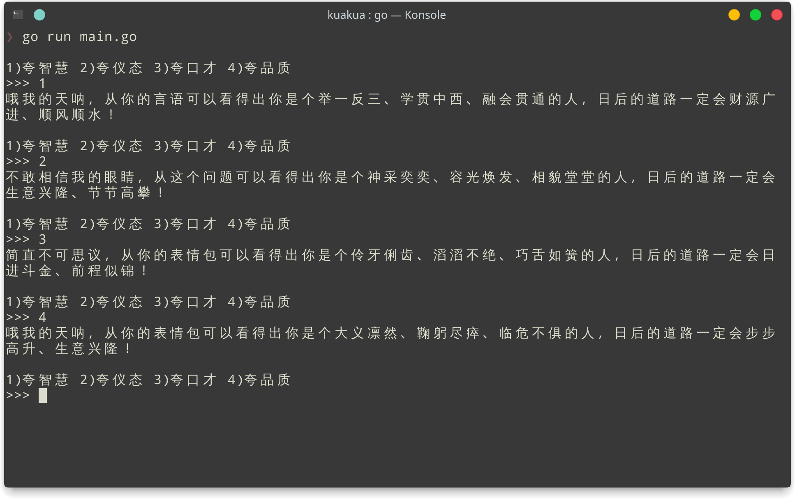

# 夸夸生成器

更多词语请打开 `data/*.txt` 自行补充。

**注意：为了实现赞美词不重复的功能，请保证 `data/*.txt` 每个文件的行数大于 3，否则程序会进入死循环。**

# 套路分析

# 如何运行

Windows 用户：[下载压缩包](https://github.com/jerryshell/kuakua/releases)解压后双击运行 `main.exe`

*nux 用户：克隆源码，`go run main.go`

# 使用示例

# Just For Fun

请各位不要当真
